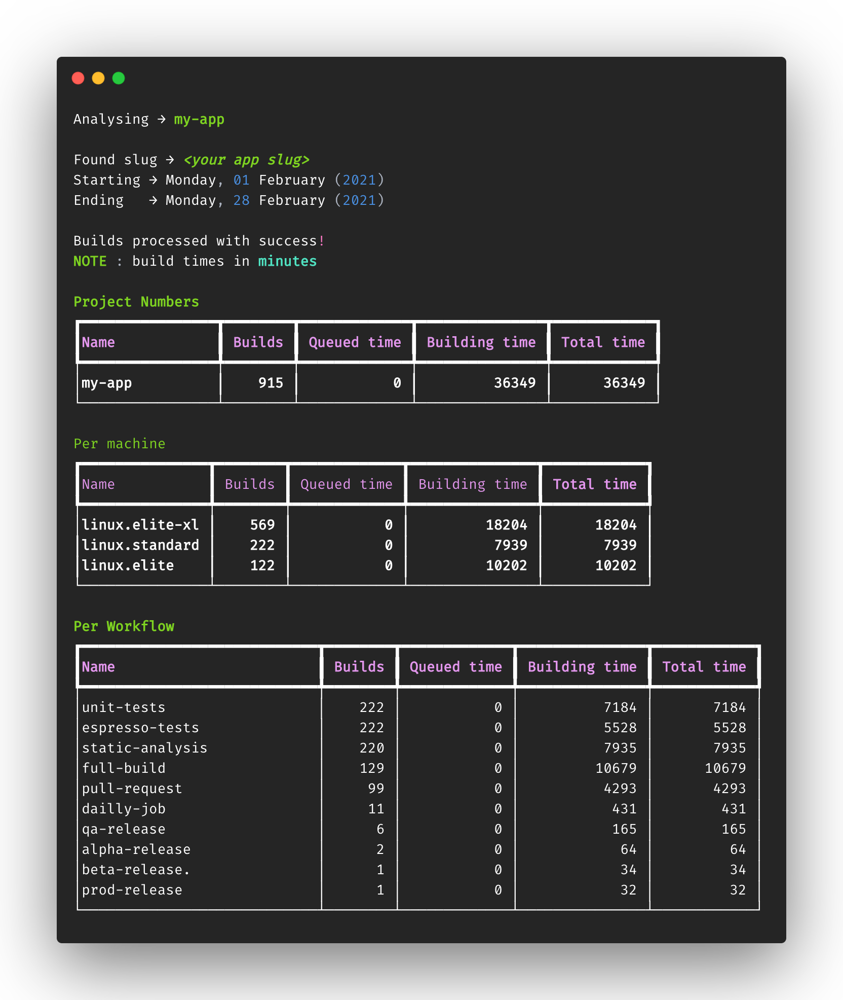
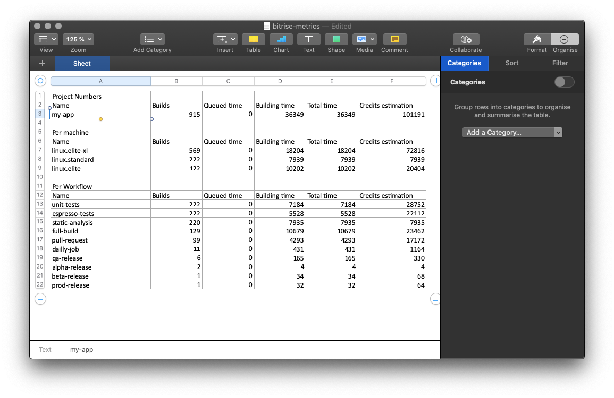

# Bitrise Reports

> _Complete blog post to come. Stay tuned!_

## Context

Main features:

- Backed by [Bitrise REST API](https://api-docs.bitrise.io/) under the hood
- Computes minutes for queued, building and total execution, for all builds in given a time frame
- Breakdown numbers per machine type (aka Bitrise Build Stack) and also per Workflow
- Supports emulation of consumed [Bitrise Velocity credits](https://www.bitrise.io/velocity-plan) (for Enterprise customers)
- Report types : CLI (stdout), JSON and Excel spreadsheet

## Installing

This tool requires Python, supporting versions 3.8.x and 3.9.x.

Install `bitrise-reports` with [pip](https://pypi.org/project/pip/)

```bash
→ pip install bitrise-reports
```

## Using

Let's say you want see analyse numbers for the project `my-app`, learning from
the builds that ran during February of 2021. You'll firstly need a
[Bitrise Personal Access Token](https://devcenter.bitrise.io/api/authentication/) for
that. Note you must be a member in the project you want to analyse.

By running

```bash
→ bitrise-reports \
    --token=$BITRISE_PAT_TOKEN \
    --app=my-app \
    --starting=2021-02-01 \
    --ending=2021-02-28
```

you should get something like that on your CLI



The full list CLI options :

| Option   | Details                                    | Required  |
|----------|--------------------------------------------|-----------|
| token    | Personal access token for Bitrise API      | Yes       |
| app      | The title of your app in Bitrise           | Yes       |
| starting | Starting date in the target time frame     | Yes       |
| ending   | Ending date in the target time frame       | Yes       |
| report   | The style of report you want               | No        |
| velocity | Estimate Bitrise Velocity credits consumed | No        |

where

- `starting` and `ending` follows **YYYY-MM-DD** convention
- `report` accepts **stdout** (default), **json** and **excel**
- `velocity`is a CLI flag

For instance, if you want an Excel spreadsheet instead of the fancy CLI UI from the previous example
while also estimating Velocity usage for the builds, you can run

```bash
→ bitrise-reports \
    --token=$BITRISE_PAT_TOKEN \
    --app=my-app \
    --starting=2021-02-01 \
    --ending=2021-02-28 \
    --report=excel \
    --velocity
```

and the output file `bitrise-reports.xlsx` will be available in the same folder.



## Contributing

If you want to contribute with this project

- Check the [contribution guidelines](https://github.com/dotanuki-labs/.github/blob/main/CONTRIBUTING.md)
- Ensure you have Python 3.8.x or newer installed
- Ensure you have [Poetry](https://python-poetry.org/) installed
- Ensure you have [Flake8](https://pypi.org/project/flake8/) installed
- Ensure you have [Black](https://github.com/psf/black) installed
- Prepare your environment

```bash
→ make setup
```

- Code you changes
- Make sure you have a green build

```bash
→  make inspect && make test
```

- Submit your PR 🔥

## Author

- Coded by Ubiratan Soares (follow me on [Twitter](https://twitter.com/ubiratanfsoares))

## License

```
The MIT License (MIT)

Copyright (c) 2021 Dotanuki Labs

Permission is hereby granted, free of charge, to any person obtaining a copy of
this software and associated documentation files (the "Software"), to deal in
the Software without restriction, including without limitation the rights to
use, copy, modify, merge, publish, distribute, sublicense, and/or sell copies of
the Software, and to permit persons to whom the Software is furnished to do so,
subject to the following conditions:

The above copyright notice and this permission notice shall be included in all
copies or substantial portions of the Software.

THE SOFTWARE IS PROVIDED "AS IS", WITHOUT WARRANTY OF ANY KIND, EXPRESS OR
IMPLIED, INCLUDING BUT NOT LIMITED TO THE WARRANTIES OF MERCHANTABILITY, FITNESS
FOR A PARTICULAR PURPOSE AND NONINFRINGEMENT. IN NO EVENT SHALL THE AUTHORS OR
COPYRIGHT HOLDERS BE LIABLE FOR ANY CLAIM, DAMAGES OR OTHER LIABILITY, WHETHER
IN AN ACTION OF CONTRACT, TORT OR OTHERWISE, ARISING FROM, OUT OF OR IN
CONNECTION WITH THE SOFTWARE OR THE USE OR OTHER DEALINGS IN THE SOFTWARE.
```
